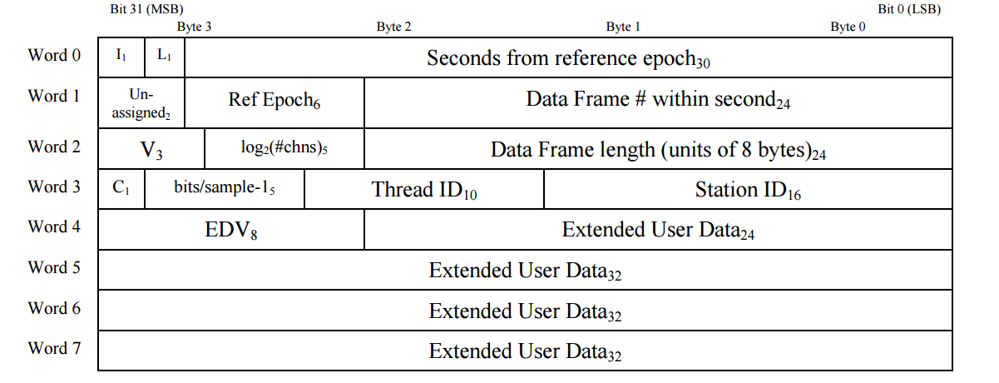

****************************
VDIF File I/O Code Structure
****************************

.. _cs_vdif_intro:

VDIF Files
==========

The `VLBI Data Interchange Format (VDIF) <http://www.vlbi.org/vdif/>`_ was
introduced in 2009 to standardize VLBI data transfer and storage.  Detailed
specifications are found in VDIF's `specification document
<http://www.vlbi.org/vdif/docs/VDIF_specification_Release_1.1.1.pdf>`_; here
we give a brief overview of the VDIF file structure and define commonly-used
terms.

A VDIF file or data transmission is composed of a sequence of data frames,
each of which is comprised of a self-identifying data frame
header followed by an array, or **payload**, of data covering a single time
segment of observations from one or more frequency sub-bands.  The time segment
over which a data frame spans can be deduced by its data frame number in the
header. The header is a pre-defined 32-bytes long, while the payload is
task-specific and can range from 32 bytes to ~134 megabytes.  Both are
little-endian and grouped into 32-bit **words**.  Further details will be
discussed in the :ref:`header <cs_vdif_header>` and 
:ref:`payload sections <cs_vdif_payload>` of the document.

A data frame may carry one or multiple frequency sub-bands (called "channels"
in the VDIF specification, but deliberately called "sub-bands" here to avoid
confusion with Fourier channels).  A sequence of data frames all carrying the
same (set of) sub-band(s) is called a **data thread**, denoted by its thread ID.
A data set consisting of multiple concurrent threads is transmitted or stored
as a serial sequence of frames called a **data stream**.  The collection of
frames that cover all threads for a single time segment - equivalently, all
thread IDs for the same frame number - is a **dataframe set** (or just "frame
set").

Strict time ordering of frames in the stream, while considered part of VDIF
best practices, is not mandated, and cannot be guaranteed during data
transmission over the internet.

.. _cs_vdif_base:

VDIF Base
=========

:file:`baseband/vdif/base.py` contains master input/output function
:func:`vdif.open() <baseband.vdif.open>`.  To read in the sample VDIF file 
:file:`baseband/data/sample.vdif` (``SAMPLE_VDIF`` in :class:`baseband.data`),
then output its first 20000 data samples as a numpy array::

    >>> from baseband import vdif
    >>> from baseband.data import SAMPLE_VDIF
    >>> fh = vdif.open(SAMPLE_VDIF, 'rs')
    >>> d = fh.read(count=20000)

For this file, ``count=20000`` corresponds to all data from its first
dataframe set.  To write this set to a file::

    >>> fw = vdif.open('./dummy_out.vdif', 'ws', nthread=8, header=fh.header0)
    >>> fw.write(d)

:func:`vdif.open() <baseband.vdif.open>` is the only function or class in the 
``vdif`` module directly accessible from :class:`~baseband.vdif` as, in lieu of
troubeshooting, it is the only thing users should access.  

When called, :func:`vdif.open() <!baseband.vdif.open>` uses :func:`io.open` to
open the binary file, then passes the `io` object to one of the VDIF base 
read/write classes.

.. _cs_vdif_base_read:

VDIF Base Reader Classes
------------------------

We can mimic the reader functionality of :func:`vdif.open() 
<!baseband.vdif.open>` showcased above with the following::

    >>> import io
    >>> fio = io.open(SAMPLE_VDIF, 'rb')
    >>> fhr = vdif.base.VDIFFileReader(fio)
    >>> fh = vdif.base.VDIFStreamReader(fhr)

:class:`~baseband.vdif.base.VDIFFileReader`, a subclass of 
:class:`vlbi_base.base.VLBIFileBase <baseband.vlbi_base.base.VLBIFileBase>`, 
reads data frames.  It includes the 
:meth:`~baseband.vdif.base.VDIFFileReader.read_frame()` and
:meth:`~baseband.vdif.base.VDIFFileReader.read_frameset()` methods, which are
simply calls to :meth:`VDIFFrame.fromdata() <baseband.vdif.frame.VDIFFrame.fromdata>` 
and :meth:`VDIFFrameSet.fromdata() <baseband.vdif.frame.VDIFFrameSet.fromdata>`, 
respectively, that return data frames or frame sets.
:class:`~!baseband.vdif.base.VDIFFileReader` also includes 
:meth:`~baseband.vdif.base.VDIFFileReader.find_header()`, which
finds the next header from the file pointer's current position.  This is used
solely to determine the ``header1`` property in 
:class:`~baseband.vdif.VDIFStreamReader`.

:class:`~baseband.vdif.VDIFStreamReader`, a subclass of 
:class:`~baseband.vdif.base.VDIFStreamBase` and
:class:`vlbi_base.base.VLBIStreamReaderBase <baseband.vlbi_base.base.VLBIStreamReaderBase>`,
translates files into data streams.  Its constructor takes in a
:class:`~!baseband.vdif.base.VDIFFileReader` instance, and during
initialization uses the instance's :meth:`read_frameset()
<!baseband.vdif.base.VDIFFileReader.read_frameset>` to read the file's
first frame set, obtaining the first frame header and the number of threads in
the stream in the process.  The frame set is stored in the ``_frameset``
class attribute.

:class:`~!baseband.vdif.VDIFStreamReader` inherits from 
:class:`~!baseband.vlbi_base.base.VLBIStreamReaderBase`
a file pointer that advances in data samples rather than bytes.  This pointer
is accessible using::

    >>> fh.offset
    0
    >>> fh.seek(0, 2)  # Position in units of samples.
    40000

The payload can be read by calling :meth:`VDIFStreamReader.read()
<baseband.vdif.base.VDIFStreamReader.read>`, which uses the sample-based
pointer to return a :class:`numpy.ndarray` with a user-defined number of
samples::

    >>> fh.seek(0)          # Return file pointer to start.
    0
    >>> data = fh.read(10)  # Return 10 samples of data in array.
    >>> data.shape
    (10, 8)

Here, ``8`` is the number of threads in the stream.

The sample-based pointer is not tied to the binary file pointer from the
:class:`~!baseband.vdif.base.VDIFFileReader` instance, which is
stored in :class:`~!baseband.vdif.VDIFStreamReader` instances as the
``fh_raw`` attribute.  This means shifting one does not automatically shift
the other; for example::

    >>> # Set sample-based pointer to halfway into the first frame
    >>> # (output is position in sample counts)
    >>> fh.seek(fh.samples_per_frame // 2)
    10000
    >>> fh.fh_raw.seek(0, 2)   # Binary pointer from fhr.
    80512
    >>> fh.tell()              # Equivalent to fh.offset.
    10000
    >>> fh.fh_raw.tell()
    80512

:meth:`~!baseband.vdif.base.VDIFStreamReader.read` advances the sample-based
pointer forward when reading data, converting it to a time to check whether
that time falls within the time segment of the currently stored frame set.
If not, a new frame set is read in using private method
:meth:`~baseband.vdif.VDIFStreamReader._read_frame_set`, which shifts the
binary file pointer to match the sample-based one, then uses
:meth:`VDIFFileReader.read_frameset() <!baseband.vdif.base.VDIFFileReader.read_frameset>`
to read in a new frameset.  This check is made each time the sample-based
pointer is advanced, and so :meth:`~!baseband.vdif.base.VDIFStreamReader.read`
is able to read subsections of data that span multiple frame sets and start
and end in the middle of sets.

To showcase the methodology of :meth:`~!baseband.vdif.base.VDIFStreamReader.read`,
we replicate its behavior for the simple case above of reading an entire file,
by obtaining the number of frames and threads in the file and then
using :meth:`VDIFFileReader.read_frameset() 
<!baseband.vdif.base.VDIFFileReader.read_frameset>`.::

    >>> import numpy as np
    >>> fb_bytesize = fh.fh_raw.seek(0, 2)
    >>> fh.fh_raw.seek(0)
    0
    >>> # Determine number number of frame sets in file and
    >>> # number of samples per frame set.
    >>> first_frameset = fh.fh_raw.read_frameset()
    >>> nframe = fb_bytesize // fh.fh_raw.tell()
    >>> nthread = first_frameset.data.shape[0]
    >>> samp_per_fset = first_frameset.header0.samples_per_frame
    >>> # Define output ndarray.  Number of Fourier channels = 1.
    >>> out = np.empty((nthread, samp_per_fset*nframe, 1), \
    ...                 dtype=first_frameset.dtype).transpose(1, 0, 2)
    >>> # Simplified version of the "while count > 0:" loop in VDIFStreamReader.read().
    >>> out[:samp_per_fset] = first_frameset.data.transpose(1, 0, 2)
    >>> for i in range(1, nframe):
    ...     cframe = fh.fh_raw.read_frameset()
    ...     out[i*samp_per_fset:(i + 1)*samp_per_fset] = \
    ...            cframe.data.transpose(1, 0, 2)
    >>> # Check that output is the same as fh.read() from above.
    >>> fh.seek(0)
    0
    >>> np.array_equal(out.squeeze(), fh.read())
    True

:class:`~baseband.vdif.VDIFStreamReader` also has the ``header1`` lazy property,
which, when called, returns the final header of the file.  It finds this
header by moving the binary file pointer to the end of the file, then advancing
the pointer backward while calling :meth:`~baseband.vdif.base.VDIFFileReader.find_header()`.

Features of VDIF Base reader classes inherited from VLBI-Base are further
discussed in the :ref:`VLBI-Base base section <cs_vlbi_base>` of the document.

.. _cs_vdif_base_write:

VDIF Base Writer Classes
------------------------

As with :class:`~baseband.vdif.base.VDIFFileReader`,
:class:`~baseband.vdif.base.VDIFFileWriter` is a subclass of
:class:`vlbi_base.base.VLBIFileBase <!baseband.vlbi_base.base.VLBIFileBase>`.
It also simply calls methods from :mod:`baseband.vdif.frame` - specifically, 
:meth:`VDIFFileWriter.write_frame() <baseband.vdif.base.VDIFFileWriter.write_frame>` 
calls :meth:`VDIFFrame.todata() <baseband.vdif.frame.VDIFFrame.todata>` and 
:meth:`VDIFFileWriter.write_frameset() <baseband.vdif.base.VDIFFileWriter.write_frameset>` 
calls :meth:`VDIFFrameSet.todata() <baseband.vdif.frame.VDIFFrameSet.todata>`.
For example, to write out the frame set stored in ``fh``::

    >>> fwio = io.open('./dummy_out.vdif', 'wb')
    >>> # This is identical to VDIFFileWriter.write_frameset(fh._frameset)
    >>> fh._frameset.tofile(fwio)
    >>> fwio.close()
    >>> # Re-open saved file to check if it's identical to the frame set
    >>> fh_saved = vdif.open('./dummy_out.vdif', 'rs')
    >>> np.array_equal(fh._frameset.data.transpose(1, 0, 2).squeeze(), 
    ...                fh_saved.read())
    True

:class:`~baseband.vdif.VDIFStreamWriter`, a subclass of 
:class:`~baseband.vdif.base.VDIFStreamBase` and
:class:`vlbi_base.base.VLBIStreamWriterBase <baseband.vlbi_base.base.VLBIStreamWriterBase>`,
writes :class:`numpy.ndarray` data to a user-defined data stream, then writes
that stream to file.  The class initializer takes a
:class:`~!baseband.vdif.base.VDIFFileWriter` object and, to partition the
data stream into frame sets, the number of threads ``nthread`` and either
the first header for the data stream or the set of values needed to construct
it from scratch.  This information is used to determine the number of samples
per frame (and frame set), and time segment of each frame.  To write to file,
:meth:`VDIFStreamWriter.write() <baseband.vdif.base.VDIFStreamWriter.write>`
advances the sample counter in steps of samples-per-frame; at each step, it
generates an appropriately time-shifted header and writes it and the
corresponding data block to file using :meth:`VDIFFileWriter.write_frameset()
<!baseband.vdif.base.VDIFFileWriter.write_frameset>`.  Proper assignment of
thread numbers is done within :meth:`VDIFFileWriter.write_frameset()
<!baseband.vdif.base.VDIFFileWriter.write_frameset>`.

To show how :meth:`VDIFStreamWriter.write() <!baseband.vdif.base.VDIFStreamWriter.write>` 
works, we replicate its behavior for the simple case of writing all data to a
file::

    >>> # Read in data to be output to file.
    >>> fh = vdif.open(SAMPLE_VDIF, 'rs')
    >>> data = fh.read()
    >>> # data is squeezed; unsqueeze here
    >>> data = np.expand_dims(data, axis=-1)
    >>> 
    >>> # Open output file.
    >>> fwio = io.open('./dummy_out.vdif', 'wb')
    >>> fwr = vdif.base.VDIFFileWriter(fwio)
    >>> 
    >>> # Initialize data frame payload storage (with VDIFStreamWriter, stored in
    >>> # ._data) with 8 threads, 1 channel
    >>> nsample = fh.samples_per_frame
    >>> payload = np.zeros((fh.nthread, nsample, fh.nchan),
    ...                    np.float32)
    >>> 
    >>> # Obtain count (# of samples to write to file), and set sample and
    >>> # frame number to 0
    >>> count = data.shape[0]
    >>> sample = 0
    >>> frame_nr = 0
    >>> # frame is a transposed view of payload.
    >>> frame = payload.transpose(1, 0, 2)
    >>> while count > 0:
    ...     # Generate a header with the new time and frame number.
    ...     c_header = fh.header0.copy()
    ...     c_header['seconds'] = fh.header0['seconds'] + \
    ...                           frame_nr // fh.frames_per_second
    ...     c_header['frame_nr'] = frame_nr 
    ...     # Write frame to file.
    ...     frame[:] = data[sample:sample + nsample]
    ...     fwr.write_frameset(payload, c_header)
    ...     # Advance sample and frame number, decrease count
    ...     sample += nsample
    ...     count -= nsample
    ...     frame_nr += 1
    >>> 
    >>> fwr.close()
    >>> 
    >>> # Check that we made a successful write (fh.header0 not equal
    >>> # to  fh_w.header0 because SAMPLE_VDIF's threads not in order)
    >>> fh_w = vdif.open('./dummy_out.vdif', 'rs')
    >>> np.array_equal(data.squeeze(), fh_w.read())
    True

The above takes advantage of the fact that ``data`` is exactly two frames long.
To handle situations where :meth:`VDIFStreamWriter.write()
<!baseband.vdif.base.VDIFStreamWriter.write>` begins or ends writing in the
middle of a frame, it keeps track of its current position using its sample-based
pointer (also inherited from :class:`~!baseband.vlbi_base.base.VLBIStreamReaderBase`),
The modulo of the sample pointer position with the number of samples per frame
(itself derived from the header) is used to determine when a frame is full
and ready to be flushed to file using :meth:`VDIFFileWriter.write_frameset()
<!baseband.vdif.base.VDIFFileWriter.write_frameset>`.

:class:`~!baseband.vdif.base.VDIFFileWriter`, and consequently
:class:`~baseband.vdif.VDIFStreamWriter`, cannot automatically write a data set
to a sequence of files.

Features of VDIF Base writer classes inherited from VLBI-Base are further
discussed in the :ref:`VLBI-Base base section <cs_vlbi_base>` of the document.

.. _cs_vdif_frame:

VDIF Frame
==========

The file I/O operations above rely on data frame classes defined in the
:mod:`baseband.vdif.frame` module.

:class:`baseband.vdif.frame.VDIFFrame`, a subclass of
:class:`baseband.vlbi_base.frame.VLBIFrameBase` houses a single VDIF frame
using :class:`baseband.vdif.header.VDIFHeader` and 
:class:`baseband.vdif.payload.VDIFPayload`.  These are accessible from
:class:`~!baseband.vdif.frame.VDIFFrame` instances through the
``_header_class`` and ``_payload_class`` private attributes, respectively.
The class instances responsible for for holding the header and payload of
the data frame are in ``header`` and ``payload``, respectively.
:meth:`VDIFFrame.__init__() <baseband.vdif.frame.VDIFFrame.__init__>` 
instantiates a frame simply by taking in header and payload objects as
arguments, only verifying the consistency between the two (eg. whether the
payload dimensions are consistent with corresponding header values) using
:meth:`VDIFFrame.verify() <baseband.vdif.frame.VDIFFrame.verify>`.  We can
therefore create a VDIF frame object by manually reading in or generating a
header and payload, then calling the :class:`~!baseband.vdif.frame.VDIFFrame`
class constructor::

    >>> from baseband import vdif
    >>> from baseband.data import SAMPLE_VDIF
    >>> import io, numpy as np
    >>>
    >>> # Manually read in frame.
    >>> fio = io.open(SAMPLE_VDIF, 'rb')
    >>> header = vdif.header.VDIFHeader.fromfile(fio, verify=True)
    >>> payload = vdif.payload.VDIFPayload.fromfile(fio, header=header)
    >>> frame = vdif.frame.VDIFFrame(header, payload)
    >>> # Reset file pointer and read first frame using VDIFFileReader.
    >>> fio.seek(0)
    0
    >>> fhr = vdif.base.VDIFFileReader(fio)
    >>> fhr_frame = fhr.read_frame()
    >>> # Check that frames are identical
    >>> frame == fhr_frame
    True

The above method is used by class method :meth:`VDIFFrameSet.fromfile()
<baseband.vdif.frame.VDIFFrameSet.fromfile>`, which reads a frame from file.
There is also the class method :meth:`VDIFFrameSet.fromfile()
<baseband.vdif.frame.VDIFFrameSet.fromfile>`, which utilizes
:meth:`VDIFHeader.fromvalues() <baseband.vdif.header.VDIFHeader.fromfile>`
to determine the header, and :meth:`VDIFPayload.fromdata()
<baseband.vdif.payload.VDIFPayload.fromdata>` to populate the data array; these
are discussed in the VDIF :ref:`header <cs_vdif_header>` and 
:ref:`payload <cs_vdif_payload>` sections, respectively.

:class:`~!baseband.vdif.frame.VDIFFrame` is a subclass of
:class:`~!baseband.vlbi_base.frame.VLBIFrameBase`, discussed in the
:ref:`VLBI-Base frame section <cs_vlbi_frame>`.
:class:`~!baseband.vdif.frame.VDIFFrame` inherits properties and
special methods that allow frame objects to be passed keywords like
with :class:`dict` objects to retrieve header values.  For example::

    >>> # Determine length of frame (in units of int32 words).  Equivalent to
    >>> # frame.header['frame_length'].
    >>> frame['frame_length']
    629
    >>> 'frame_length' in frame
    True
    >>> 

Frames can also be indexed or sliced like a :class:`numpy.ndarray` to
retrieve payload data::

    >>> # Determine first sample.  Equivalent to frame.payload[0,0].
    >>> frame[47, 0]
    1.0

This indexing uses ``frame.payload.__getitem__()`` to decode the payload
from int-32 words to data samples (discussed further in the :ref:`payload <cs_vdif_payload>`
section).  Likewise, we can assign values to slices (which calls
``frame.payload.__setitem__()``)::

    >>> # Set frame[47, 0] to -1.0
    >>> frame[47, 0] = -1.0
    >>> frame[47, 0]
    -1.0

The safest way to access :class:`~!baseband.vdif.frame.VDIFFrame` is with
the read-only ``data`` property::

    >>> # Determine first sample.  Equivalent to frame[0,0].
    >>> frame.data[47, 0]
    -1.0
    >>> # ``data`` is read-only, though no error message returned when
    >>> # we attempt to set it.
    >>> frame.data[47, 0] = 3.3359001
    >>> frame.data[47, 0]
    -1.0

:class:`baseband.vdif.frame.VDIFFrameSet` stores a frame set (a collection of
frames storing all threads for a single time segment) as a list of
:class:`~!baseband.vdif.frame.VDIFFrame` objects.  Its constructor simply takes
in a list as an argument, and stores the first header in the list as the
``header0`` attribute.  We can initialize a :class:`~!baseband.vdif.frame.VDIFFrameSet`
instance by reading in all frames of the same frame number from a file, then
sorting these frames by their thread number::

    >>> fio.seek(0)
    0
    >>> # Read in first header to determine frame_nr.
    >>> header0 = vdif.header.VDIFHeader.fromfile(fio, verify=True)
    >>> header = header0
    >>> # Declare empty array to store frames.
    >>> frames = []
    >>> # While loop to read in frames.
    >>> while header['frame_nr'] == header0['frame_nr']:
    ...     frames.append(vdif.frame.VDIFFrame(header, 
    ...                   vdif.payload.VDIFPayload.fromfile(fio, header),
    ...                     verify=True))
    ...     header = vdif.header.VDIFHeader.fromfile(fio, header0.edv)
    >>> frames.sort(key=lambda frame: frame['thread_id'])
    >>> frameset = vdif.frame.VDIFFrameSet(frames)
    >>> # Reset file pointer and read first frameset using VDIFFileReader.
    >>> fio.seek(0)
    0
    >>> fhr2 = vdif.base.VDIFFileReader(fio)
    >>> fhr2_frameset = fhr2.read_frameset()
    >>> all(f1 == f2 for f1, f2 in zip(frameset.frames, fhr2_frameset.frames))
    True

The above is essentially how :meth:`VDIFFrameSet.fromfile()
<baseband.vdif.frame.VDIFFrameSet.fromfile>` works; this class method can
also selectively read thread IDs and detect if the end-of-file is reached
before all requested frames are read in.  Alternatively, a frame set can be
made by passing an array of dimensions ``(nthread, nsample, nchan)`` and a
corresponding list of headers - or a set of keywords to generate headers
from - to class method :meth:`VDIFFrameSet.fromdata() 
<baseband.vdif.frame.VDIFFrameSet.fromdata>`.

.. note::

    When generating a :class:`~!baseband.vdif.frame.VDIFFrameSet` instance
    using the constructor, or from data, ``header0`` is the first header in
    the sorted list of data frames.  When using  :meth:`VDIFFrameSet.fromfile()
    <baseband.vdif.frame.VDIFFrameSet.fromfile>`, however, ``header0`` is
    the **first frame of the set stored in the file**.  This is to handle
    situations where subsequent headers in the set are corrupted.

    Indeed, following the code block above, the expression
    ``frameset == fhr2_frameset`` would return ``False``, since 
    ``fhr2_frameset.header0['thread_id']`` is ``1``, while in ``frameset``
    it is ``0``.

Like :class:`~!baseband.vdif.frame.VDIFFrame`, :class:`~!baseband.vdif.frame.VDIFFrameSet`
defines special methods that allow for equality comparisons between two
frame sets, and dict-like keyword retrieval of quantities from ``header0``::

    >>> frameset['frame_nr']
    0

:class:`~!baseband.vdif.frame.VDIFFrameSet` also defines
a ``data`` attribute, which copies the frames' payload data into a 
``numpy.ndarray`` with dimensions ``(nthread, nsample, nchan)``, as well as
``size``, ``shape`` and ``dtype`` properties that return the appropriate values
for this array::

    >>> frameset.data.shape
    (8, 20000, 1)
    >>> frameset.data[2, 13, 0]
    -3.3359001

Since ``data`` is a copy, and not a view, of the individual frame payloads,
it can be modified, but these modifications are **not** propagated back into
the individual frames.

.. _cs_vdif_header:

VDIF Header
===========

Each VDIF frame begins with a 32-byte, or 8-word, header (16-bytes for the 
"VDIF legacy headers")

   Schematic of the standard 32-bit VDIF header, from `VDIF specification 
   release 1.1.1 document, Fig. 3
   <http://www.vlbi.org/vdif/docs/VDIF_specification_Release_1.1.1.pdf>`_.
   32-bit words are labelled on the left, while byte and bit numbers above
   indicate relative addresses within each word.  Subscripts indicate field
   length in bits.

where the abbreviated labels are

- :math:`\mathrm{I}_1` - invalid data
- :math:`\mathrm{L}_1` - if 1, header is VDIF legacy
- :math:`\mathrm{V}_3` - VDIF version number
- :math:`\mathrm{log}_2\mathrm{(\#chns)}_5` - :math:`\mathrm{log}_2` of the
  number of sub-bands in the frame
- :math:`\mathrm{C}_1` - if 1, complex data
- :math:`\mathrm{EDV}_8` - "extended data version" number; see below

Detailed definitions of terms are found on pg. 5 - 7 of the `VDIF specification
document <http://www.vlbi.org/vdif/docs/VDIF_specification_Release_1.1.1.pdf>`_.

Words 4 - 7 hold optional extended user data that is telescope or experiment-
specific.  The layout of this data is specified by the "extended-data version",
or EDV, in word 4, bit 24 of the header.  Registered EDV formats, found on
the VDIF website, are all supported by Baseband, and the code is written so that
new EDVs can be defined by the user.

When :class:`~baseband.vdif.VDIFStreamReader` is initialized, it calls classes
from :mod:`baseband.vdif.header` to read the header, specifically by passing the
:class:`~baseband.vdif.base.VDIFFileReader` instance into class method
:meth:`VDIFHeader.fromfile() <baseband.vdif.header.VDIFHeader.fromfile>`.  We
can reproduce this behaviour with::

    >>> import io
    >>> import baseband.vdif as vdif
    >>> from baseband.data import SAMPLE_VDIF
    >>> fio = io.open(SAMPLE_VDIF, 'rb')
    >>> fhr = vdif.base.VDIFFileReader(fio)
    >>> header = vdif.header.VDIFHeader.fromfile(fhr)
    >>> header.ref_epoch  # Number of 6-month periods after Jan 1, 2000.
    28

We can also call class method :meth:`VDIFHeader.fromvalues()
<baseband.vdif.header.VDIFHeader.fromkeys>` to manually define a header::

    >>> # Dereference header info to feed into VDIFHeader.fromkeys
    >>> header_fromkeys = vdif.header.VDIFHeader.fromkeys(**header)
    >>> header_fromkeys == header
    True

A similar method is :meth:`VDIFHeader.fromvalues()
<baseband.vdif.VDIFHeader.header.fromvalues>`, which also takes derived
properties like ``bps`` and ``time``.

:class:`~!baseband.vdif.header.VDIFHeader` can also be directly initialized
with an array of words, but this is not used in practice.

Perhaps unintuitively, the ``type`` of the header is 
:class:`~baseband.vdif.header.VDIFHeader3`::

    >>> isinstance(header, vdif.header.VDIFHeader3)
    True

Baseband pairs each EDV format with its own header class 
(:class:`~baseband.vdif.header.VDIFHeader3` is for ``EDV = 0x03``, or NRAO data), 
and currently accommodates EDVs 1 through 4, as well as the 4-word legacy VDIF 
header and Mark 5B headers transformed into VDIF (``EDV = 0xab``).

:meth:`VDIFHeader.fromfile() <!baseband.vdif.header.VDIFHeader.fromfile>`, 
:meth:`VDIFHeader.fromvalues() <!baseband.vdif.header.VDIFHeader.fromkeys>`, and
:meth:`VDIFHeader.fromvalues() <!baseband.vdif.header.VDIFHeader.fromvalues>`
call :meth:`VDIFHeader.__new__() <!baseband.vdif.header.VDIFHeader.__new__>`,
which accesses the registry of EDV classes through the metaclass
:class:`VDIFHeaderMeta <baseband.vdif.header.VDIFHeaderMeta>`
to initialize and return the appropriate class instance.

New header classes can be added to the registry by subclassing them from either
:class:`~!baseband.vdif.header.VDIFHeader` or one of its subclasses, and
including an ``edv`` attribute whose value is not already in use by another
class.  For example::

    >>> from baseband import vlbi_base
    >>> class MyVDIFHeader(vdif.header.VDIFSampleRateHeader):
    ...     _edv = 47
    ...
    ...     _header_parser = vdif.header.VDIFSampleRateHeader._header_parser +\
    ...         vlbi_base.header.HeaderParser(
    ...                             (('nonsense', (6, 0, 32, 0x0)),))

This class can then be used like any other::

    >>> myheader = vdif.header.VDIFHeader.fromvalues(
    ...     edv=47, time=header.time,
    ...     samples_per_frame=header.samples_per_frame,
    ...     station=header.station, bandwidth=header.bandwidth,
    ...     bps=header.bps, complex_data=header['complex_data'],
    ...     thread_id=header['thread_id'], nonsense=2000000000)
    >>> isinstance(myheader, MyVDIFHeader)
    True
    >>> myheader['nonsense'] == 2000000000
    True

Header values directly embedded in the words can be retrieved using their
keywords, as shown for ``nonsense``.  They are also accessible as properties
via the dot operator, as are derived properties such as ``samples_per_frame``
or ``time``.  Note that ``time``, which returns an :mod:`astropy.time` object,
will return an error if the sampling rate (only written for ``EDV = 0x03``)
is not available.

Each EDV class houses a ``_struct`` attribute that refers to a
:class:`struct.Struct` binary reader that converts binary into a tuple of
int-32 words.  VDIF header classes use either the :obj:`vlbi_base.eight_word_struct
<baseband.vlbi_base.header.eight_word_struct>` or :obj:`vlbi_base.four_word_struct
<baseband.vlbi_base.header.four_word_struct>` (the latter only for legacy
headers).  While obviously not meant to be publicly used, ``_struct`` can be
called to unpack a bytes object::

    >>> # Generate blank EDV = 3 header (not self-consistent, so verify=False).
    >>> header_blank = vdif.header.VDIFHeader([0,0,0,0,0,0,0,0], 
    ...                                       edv=3, verify=False)
    >>> # Read in first 32 bytes from SAMPLE_VDIF file, then 
    >>> # unpack with _struct.unpack()
    >>> fhr.seek(0)
    0
    >>> s = fhr.read(32)
    >>> header_blank.words = list(header_blank._struct.unpack(s))
    >>> # Verify for self-consistency, then check against
    >>> header_blank.verify()
    >>> header_blank == header
    True

Above, we initialize a blank header using an array of eight int-32s set to zero;
:class:`~!baseband.vdif.VDIFFileReader` (and subclasses) also accepts tuple or 
:class:`!numpy.ndarray`, though the type used will determine whether the header
is mutable.  If a tuple were passed instead, for example, ``header_blank``
would be immutable, and ``header_blank.mutable = True`` would have to be used
before modifying its words.  The ``words`` and ``mutable`` attributes are
inherited from :class:`vlbi_base.VLBIHeaderBase <baseband.vlbi_base.header.VLBIHeaderBase>`,
and discussed further in the :ref:`VLBI-Base header section <cs_vlbi_header>`
section.

Each class also has a ``_header_parser`` that reads and writes values to
the header, and which is defined in accordance with their respective
EDV specification.  Custom header parsers can be defined by calling
:class:`vlbi_base.header.HeaderParser <baseband.vlbi_base.header.HeaderParser>`,
as we did above when creating the custom header definition::

    >>> # To construct a header parser
    >>> header_blank._header_parser = vlbi_base.header.HeaderParser(
    ...                               (('somestuff', (0, 0, 32, 0)),))
    >>> header_blank.words[0] = 88888888
    >>> header_blank['somestuff'] == 88888888
    True

One ``_header_parser`` can be appended to another: for 
example, the ``MyVDIFHeader`` custom header, above, combines the parser from 
:class:`~baseband.vdif.header.VDIFSampleRateHeader` with one that has
"nonsense" in word 6.  Indeed, the header parsers of all EDV classes are
constructed by appending to the parser from 
:class:`~!baseband.vdif.header.VDIFBaseHeader`, which itself is created by
appending to :class:`~!baseband.vdif.header.VDIFLegacyHeader`.

The header parser class, and the special methods in VDIF header classes 
that enable dict-like access and writing of headers, are also inherited from
:class:`vlbi_base.VLBIHeaderBase <baseband.vlbi_base.header.VLBIHeaderBase>`;
see :ref:`its section <cs_vlbi_header>` for implementation details.
:class:`_VDIFHeaderRegistry <!baseband.vdif._VDIFHeaderRegistry>`

.. _cs_vdif_payload:

VDIF Payload
============

VDIF payloads are composed of even numbers of 32-bit words, each of which is
subdivided into one or more sample fields.  Each sample, then, takes up between
1 and 32 bits large.  The oldest sample in each word occupies the field
including bit 0, and subsequent samples fill the next lowest-order bit until
no more space remains for a full sample.  If any bits remain, they are unused,
and the next sample is written to the field including bit 0 in the next word.
For complex-valued payloads, the "quadrature" (Q) component is stored
immediately after the "in-phase" (I) one.  When each component is less than
16 bits, if no more space remains for a full complex number, that sample is
written to the next word.  When each component is more than 16 bits, the
quadrature component is stored in the next word.  For frames containing multiple
sub-bands, each complete sample (i.e. with all sub-bands included) occupies a
contiguous block within an array.  Individual samples are restricted to
:math:`2^\mathrm{k}` bits, with a maximum of 32 bits (so an integer number
always fits within one word).  A complete sample, on the other hand, may
exceed one word, in which case it is extended to the next, but no complete
sample may exceed one data frame.  If the individual samples are complex, the
two components are stored in adjacent fields, and the complete sample taken
to be that for all components and all sub-bands.  More detailed discussion of
the payload, and example layouts, are found on pg. 7 - 11 of the `VDIF
specification document <http://www.vlbi.org/vdif/docs/VDIF_specification_Release_1.1.1.pdf>`_.

Reading and writing VDIF data, including converting them between 32-bit words
and samples, is the task of :class:`baseband.vdif.payload.VDIFPayload`,
a subclass of :class:`baseband.vlbi_base.payload.VLBIPayloadBase>`.
Its constructor takes an iterable of 32-bit words and, in order to parse
these, either a sample header or the number of sub-bands, bits per sample,
and whether the samples are complex::

    >>> import baseband.vdif as vdif
    >>> import numpy as np
    >>> import io
    >>> from baseband.data import SAMPLE_VDIF
    >>> fhr = vdif.base.VDIFFileReader(io.open(SAMPLE_VDIF, 'rb'))
    >>> # Extract payload words from sample VDIF
    >>> frame = fhr.read_frame()
    >>> words = frame.payload.words.copy()
    >>>
    >>> # Create new payload with 1 sub-band and 2 bits per sample
    >>> payload = vdif.payload.VDIFPayload(words, nchan=1, bps=2)
    >>> payload == frame.payload
    True

In practice, the class methods :meth:`VDIFPayload.fromfile()
<baseband.vdif.payload.VDIFPayload.fromfile>` and :meth:`VDIFPayload.fromdata()
<baseband.vdif.payload.VDIFPayload.fromdata>` are used instead, since we
rarely instantiate payloads directly from 32-bit words::

    >>> fhr.fh_raw.seek(0)
    0
    >>> header = vdif.header.VDIFHeader.fromfile(fhr.fh_raw)
    >>> payload = vdif.payload.VDIFPayload.fromfile(fhr.fh_raw, header)
    >>> payload_fromdata = vdif.payload.VDIFPayload.fromdata(
    ...                                         payload.data, bps=2, edv=3)
    >>> payload == payload_fromdata
    True

Reading from file requires we include the header as an argument, while
reading from data needs either the header or manual specification of the bits
per sample and EDV.

Payload samples can be accessed through the read-only ``data`` property, as
well as directly via list-like indexing and slicing::

    >>> payload.data[0]
    array([ 1.], dtype=float32)
    >>> payload[10:12]
    array([[ 3.33590007],
           [-1.        ]], dtype=float32)

This functionality is inherited from :class:`baseband.vlbi_base.payload.VLBIPayloadBase>`,
with ``data`` using ``VLBIPayloadBase.__getitem__`` as its getter.

Meanwhile, data is stored in memory as a :class:`numpy.ndarray` of int32
words, rather than individual samples.  Consequently, each time data is
accessed for reading or writing it must be converted, which is the role
of the ``_encoders`` and ``_decoders`` objects stored within
:class:`~baseband.vdif.payload.VDIFPayload`.  (:class:`baseband.vlbi_base.payload.VLBIPayloadBase>`
also features these attributes, but there they are deliberately left blank
since these are sample size specific.)  Each is a dictionary of functions
that converts words to samples (or vice versa), indexed by the number of bits
per sample.  For example, ``_decoders[2]`` converts words into 2-bit samples.
The functions themselves are mostly defined in :mod:`baseband.vdif.payload`, and
include :func:`~baseband.vdif.payload.decode_2bit` and
:func:`~baseband.vdif.payload.decode_4bit`.  A few, such as 
:func:`~baseband.vlbi_base.payload.encode_8bit`, are imported from
:mod:`baseband.vdif.payload`, while others, such as 
:func:`~baseband.vlbi_base.payload.encode_2bit_base`, are used by other encode
and decode functions.

Additionally, :class:`~baseband.vdif.payload.VDIFPayload` inherits
a number of properties from :class:`baseband.vlbi_base.payload.VLBIPayloadBase>`,
including ``size``, ``shape``, ``nsample`` and ``sample_shape`` that record
the dimensions of the payload, and ``dtype``, which in practice returns
whether or not the data is complex.  It also inherits special methods for
determining the equality of two payloads, which we utilized above, and is also
used by :class:`~baseband.vdif.frame.VDIFFrame` to determine if two frames are
identical.

